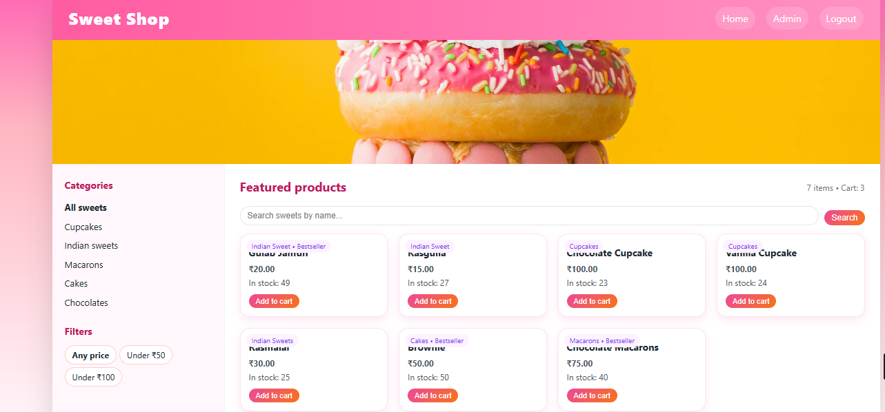

# Sweet Shop – Django + React

Full‑stack sweets shop application with Django REST API backend and React frontend. It lets users browse sweets, filter by category and price, and simulate purchases, while admins can manage inventory.

## Features

- User authentication is handled through registration and login forms on the frontend, with token-based authentication implemented on the backend.​
- The API for managing sweets is protected, allowing users to list, search, create, update, purchase, and delete sweets, while ensuring that only administrators can perform certain operations.​
- Inventory management involves decreasing stock when sweets are purchased and increasing it when they are restocked, with administrators having visibility into the total stock value and the overall count of items.

## User experience

-  A dashboard where you can see all the sweets, including what they're called, what type they are, how much they cost, and how many are in stock.​
- You can look for a specific sweet by its name, or use the side menu to narrow things down by type of sweet (like cupcakes, Indian desserts, macarons, or cakes) and by price (anything, less than 50 rupees, or less than 100 rupees).​
- “Add to cart” / “Purchase” button on each sweet, automatically disabled when quantity reaches zero.​
- There's a little number in the top corner showing how many items are in your cart, and when you buy something, a green message pops up to let you know it went through.
- 
## Visual touches and badges

- “Low stock” label when the remaining quantity is below a threshold to make inventory status obvious.​
- “Bestseller” label for sweets considered popular or high‑stock, making the UI feel more like a real shop.​

## Admin panel

- Admin‑only React page to create new sweets (name, category, price, quantity in stock) via the protected API.​
- Admin can restock and delete sweets, plus see the total number of sweets and the total stock value (sum of price × quantity) at a glance

## Tech Stack

- Backend: Django, Django REST Framework, pytest, and SimpleJWT for JSON Web Token authentication
- Frontend: React, Vite, Axios
- Database: SQLite (for development)
- Auth: JSON Web Tokens (SimpleJWT) or Django auth (update this line to what you used)
- Language: Python 3.11, JavaScript (ES6+)

## How to run locally

1. Clone the repository

- git clone https://github.com/rishika2507/sweet-shop.git
= cd sweet-shop

2. Backend (Django API)

- python -m venv venv
- venv\Scripts\activate 
- pip install -r requirements.txt
- python manage.py migrate
- python manage.py runserver

3. Frontend (React)

- cd frontend
- npm install
- npm run dev

## Usage Flow

- Register a new user or log in with existing credentials from the React app.​
- Browse the sweets on the dashboard; use search and the sidebar filters to narrow down items.​
- Adding a sweet to the cart increases the counter, decreases stock, and displays a success message. ​
- Admin users can access an admin page to manage sweets by creating, restocking, or deleting them, and can also view total stock value and item counts.

## Website Interface

### My AI Usage

AI tools were utilized as assistants to accelerate the development process in this project. However, all design choices and final modifications to the code were subject to manual review and comprehension.​
Examples of AI usage:
- Brainstorming API endpoint structure and TDD test cases for the Django REST backend.​
- Felt that AI made me faster on boilerplate and syntax, but the important design decisions and final structure came from my own understanding of the project.​
- Learned to debug better by asking AI to explain certain errors, then fixing the problems manually in my code. ​

Reflection:
AI accelerated the setup of repetitive code and the consideration of potential issues, particularly for tests and managing frontend state. It also aided in identifying configuration errors sooner. However, it remained essential to review, comprehend, and modify all AI-generated code to ensure the codebase's uniformity and adherence to project specifications.​

  
